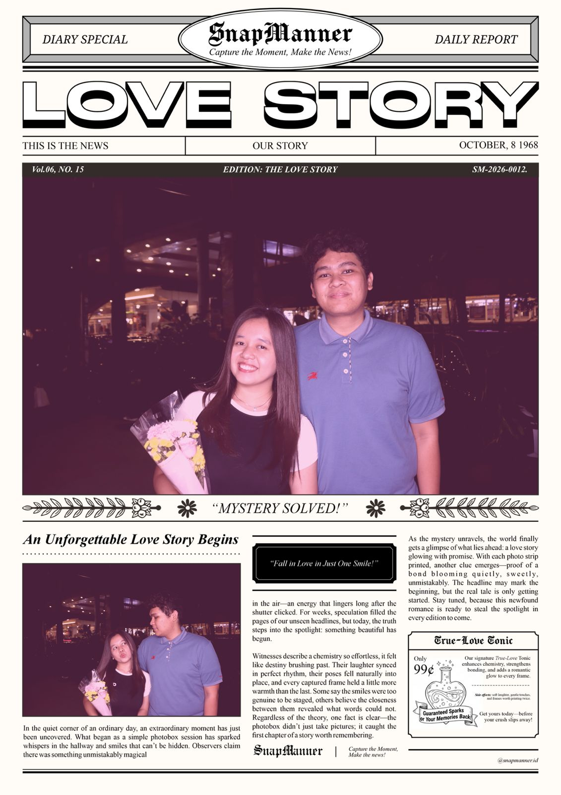

<!DOCTYPE html>
<html lang="id">
<head>
    <meta charset="UTF-8">
    <meta name="viewport" content="width=device-width, initial-scale=1.0">
    <title>HBD Sayang! <3</title>
    <link href="https://fonts.googleapis.com/css2?family=Quicksand:wght@500;700&family=Caveat:wght@700&display=swap" rel="stylesheet">
    
</head>
<body>

    <audio id="myAudio" loop>
        <source src="kasih putih.mp3" type="audio/mpeg">
    </audio>

    

        <h1>Hi Babe! i have something for u ;p</h1>
        
🌸

        <button class="btn-open" onclick="openLetter()">Buka Pesan Spesial 💌</button>
    

    

        

            
            

            Tutup Pesan
        

    

    
</body>
</html>
